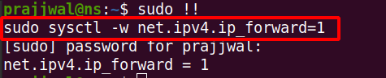
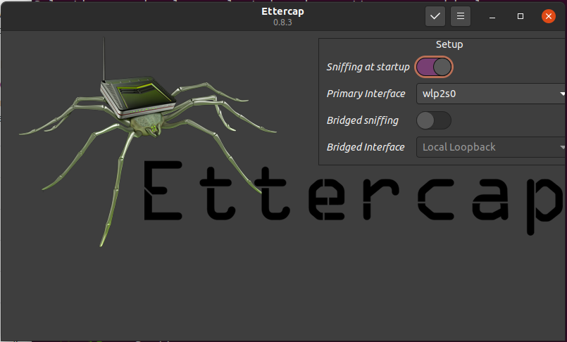
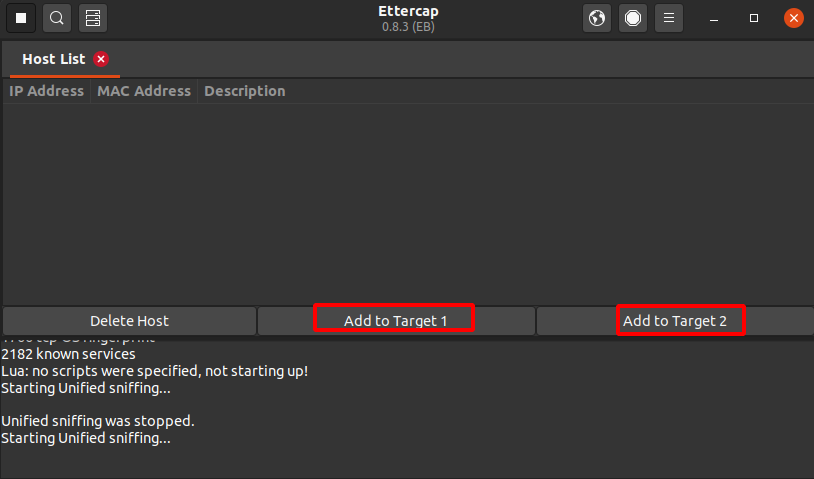
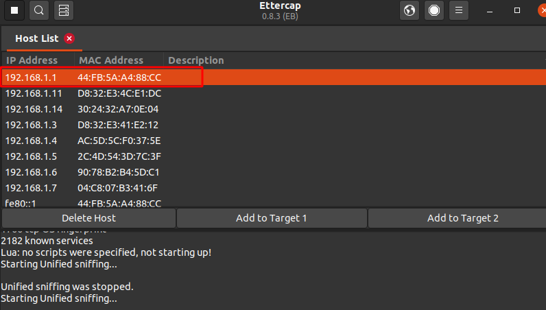
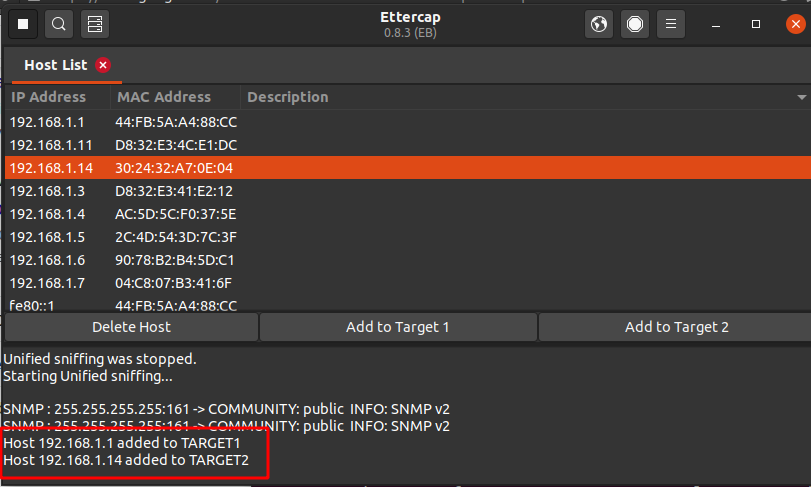
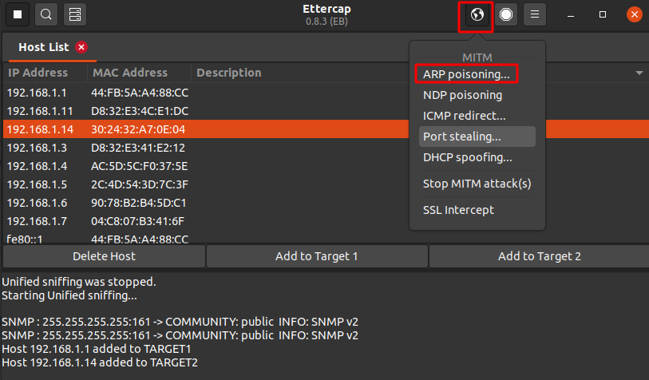
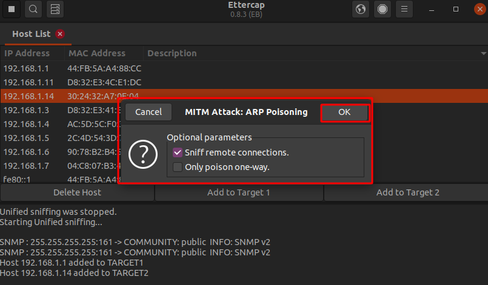
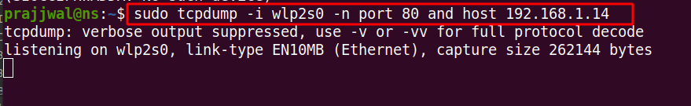
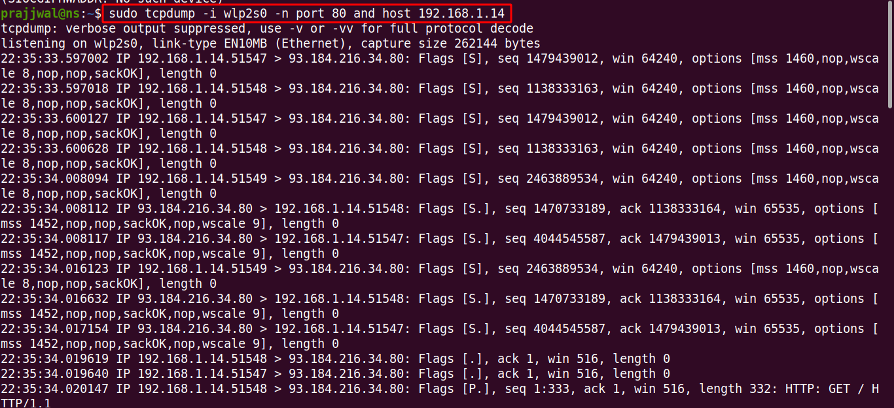

# MITM Attacks

### What is man in the middle attacks?

The Man-In-The-Middle Attack is an attack in which an attacker evesdrop and possibly alters the communication between two hosts over the network and steals sensitive data to perform more attacks.


An example of an offline MIM attack is the interception of a letter by the mailman who either just reads its contents or even replaces its contents. Other example for explaining the man-in-the-middle attack will the use of intercepting proxy like burp which we do on the daily basis.  Normally, when we want to interact with a website, the traffic is directly send to the web server without any modification. But in case of man-in-the-middle attack the attacker sits between the user and the server and can see and modify all the traffic that passes through, similar to what we do using burp proxy.


### MITM attack techniques : 

* ARP Cache Poisoning
* DNS Spoofing
* Session Hijacking
* SSL Hijacking

#### Address Resoultion Protocol Communication \(ARP\) 

In the normal ARP communication, the host PC will send a packet which has the source and destination IP address inside the packet and will broadcast it to all the devices connected to the network. The device which has the target IP address will only send the ARP reply with its MAC address in it and then communication takes place. ARP request and replies don’t require any authentication or verification

Dynamic ARP Inspection and having a static entry for the gateway in ARP cache table helps in prevention from the ARP poisioning attacks.

#### ARP Cache Poisoning

In ARP cache poisoning, the attacker would be sniffing onto the network by controlling the network switch to monitor the network traffic and spoof the ARP packets between the host and the destination PC and perform the MIM attack.

Tools : Ettercap, Dsniff and Cain and Abel’s etc.

#### DNS Spoofing

Whenever we enter a website on our PC, DNS request is sent to the DNS Server and we will get a DNS reply message in the response.


This DNS request and reply are mapped together with a unique identification number. If the attacker gets hold of the unique identification number then by disguising the victim with a corrupt packet containing the identification number the attack can be launched.


The host computer wants to connect to a website so it will send a DNS query request to the DNS server but due to the MIM attack the attacker will intercept this DNS query and send a fake DNS reply to the host PC. The host PC wouldn’t come to know whether the response is legitimate or not and it will start communicating with the malicious website of the attacker which causes data breaches.

#### Session Hijacking

A session is established when we have a connection between the client and a server. 

TCP is referred as a session since it first establishes a connection, then transfers the data and finally terminates the connection. This is known as the 3-way handshake process which shows how a proper session looks like. One of the popular session hijackings is done by stealing cookies with the help of Hyper Text Transfer Protocol \(HTTP\).

Once the session is established after successful login, unless and until one logs out the session is not terminated, so to administer session cookies are used that provide information that the session is still continuing. If the attacker gets hold of this cookie he/she can have the session information which might be secretive.


**Session Hijacking Attacks** - Once the session is established between the host PC and the web server the attacker can obtain certain parts of the session establishment which is done by capturing the cookies that were used for the session establishment. As shown in the figure 6 after the session establishment the attacker obtains the session information between the host PC and the web server and controls the session.

#### Secure Socket Layers

Secure Socket Layers \(SSL\) or Transport Layer Security \(TLS\) is used to provide security while communicating with network devices by using encryption methodology.

**Example** : Suppose a host PC wants to communicate with yahoo mail then the process starts as 

1. Using HTTP port 80, the client web browser will connect to [http://mail.yahoo.com](http://mail.yahoo.com).
2. The web server will process this request and redirects the client to the HTTP version of this website using HTTP code 302 redirect.
3. The client will now connect to [https://mail.yahoo.com](https://mail.yahoo.com) using port 443.
4. The server will provide a certificate to the host PC to verify the identity of the website using the digital signature.
5. The host PC will now verify this certificate with the list of certificates it has.


If the certificate doesn’t match with the list of certificates of the host PC then we say that the website has failed to verify its identity so the host PC will get a certificate validation error.

**Practical Scenarion for SSL Stripping attack**

This attack is based on DNS Spoofing and SSL stripping. 


### Attacks

#### Man-In-The-Middle attack using ARP Spoofing & Poisioning

The ARP Spoofing and Poisioning attacks works because of **the lack of any kind of authentication mechanism while updating ARP cache**. New IP to MAC values always overwrite the previous values in the ARP cache.

**Note:** Most Linux computers are not configured for automatic packet forwarding. To enable packet forwarding whenever the system starts, change the **net**.**ipv4**.i**p\_forward** variable in /etc/sysctl. or run this command

```text
$ sudo sysctl -W net.ipv4.ip_forward=1
```



Start the Ettercap in graphical mode using command 

```text
$ sudo ettercap -G
```

Now from the ettercap menu, select unified sniffing and select the interface you want to listen on.





Now wait for a while, while the ettercap scans the hosts in the network, then go to options and hosts. Add the router or the gateway address as Target 1 and the victim machine address as Target 2.





Go to the mitm menu and select "ARP Poisoning". On the dialog box make sure that "Sniff remote connection" checkbox is checked. 





Now, the ettercap has done the ARP poisoning and we will be able to sniff the traffic from the victim machine. 

To sniff the traffic from the victim machine, you can use any network sniffer like tcpdump or wireshark. Here, we are using tcpdump. Run this command to listen to the traffic on port 80 from the victim machine i.e. \(192.168.1.14\)



In the victim machine go to the url "http://www.example.com" and see that all the traffic is successfully being captured in the tcpdump. Hence the man in the middle attack is successful.



